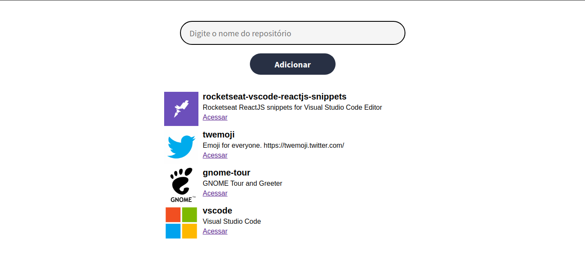

<table align="center"><tr><td align="center" width="9999">

 

[Screens](#Screens) |
[Módulo 1](https://github.com/EmmanuellaAlbuquerque/starter_rocketseat/tree/master/curso-ES6/modulo1) |
[Módulo 2](https://github.com/EmmanuellaAlbuquerque/starter_rocketseat/tree/master/curso-ES6/modulo2) |
[Módulo 3](https://github.com/EmmanuellaAlbuquerque/starter_rocketseat/tree/master/curso-ES6/module3) |
[Módulo 4](https://github.com/EmmanuellaAlbuquerque/starter_rocketseat/tree/master/curso-ES6)

#### Javascript ECMAScrip 6 course of Rocketseat Starter.

</td></tr></table>

## Screens
 

* Searches repositories for a particular github account and displays them on the screen
- Ex.: emmanuellaAlbuquerque/to-do

