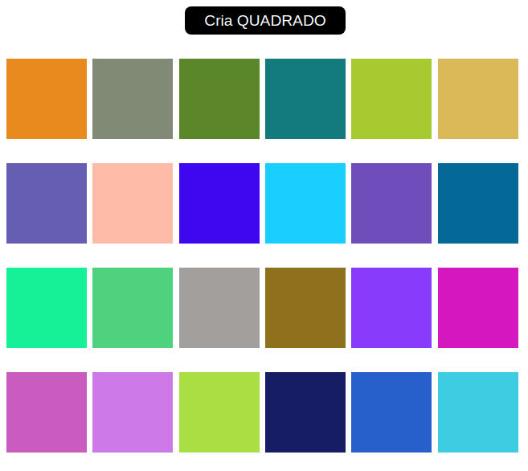

<table align="center"><tr><td align="center" width="9999">

 

[Screens](#Screens) |
[Módulo 1](https://github.com/EmmanuellaAlbuquerque/starter_rocketseat/tree/master/curso-JavaScript/modulo1) |
[Módulo 2](https://github.com/EmmanuellaAlbuquerque/starter_rocketseat/tree/master/curso-JavaScript/modulo2) |
[Módulo 3](https://github.com/emmanuellaAlbuquerque/to-do) |
[Módulo 4](https://github.com/EmmanuellaAlbuquerque/starter_rocketseat/tree/master/curso-JavaScript/modulo4)

#### Javascript course of Rocketseat Starter.

</td></tr></table>

## Screens
 

* Creates a new square by pressing the add button and hovering over it, changes its color

