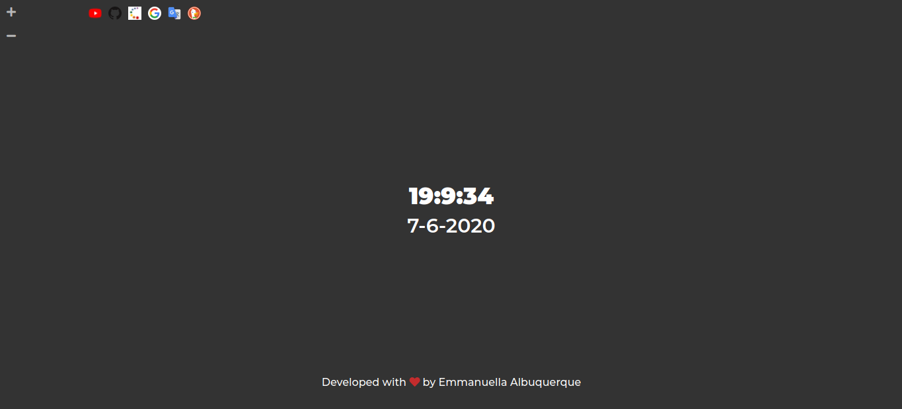

<table align="center"><tr><td align="center" width="9999">

#### Actual Time

</td></tr></table>

## Screens
 

### Extra projects developed with the learning acquired from the JavaScript Starter Course.

Link: [actual-time](https://actualtime.netlify.app)

