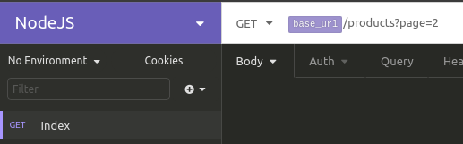
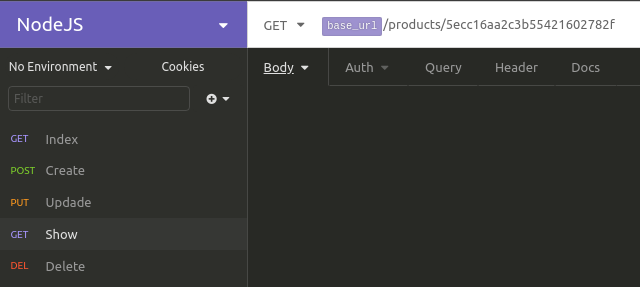
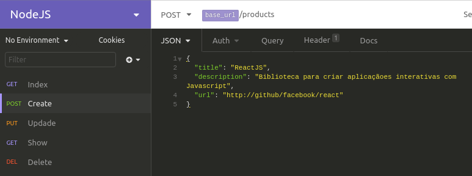
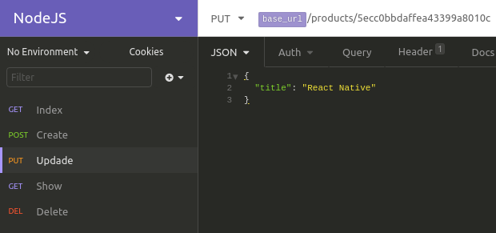
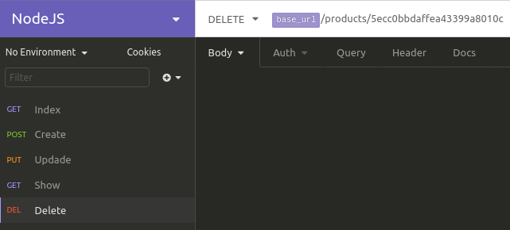

<table align="center"><tr><td align="center" width="9999">

 

[Screens](#Screens) |
[NodeAPI](https://github.com/EmmanuellaAlbuquerque/starter_rocketseat/tree/master/curso-NodeJS/node-api) |

#### NodeJS course of Rocketseat Starter.

</td></tr></table>

## Screens
 

A rest api in nodejs to create, list, delete and edit products. The goal was to create a base api similar to that of the product hunt, for that reason the name JSHunt.

### Example of use in Insomnia:
 

- GET </list all products>

- GET BY ID </lists the product based on the id>

- POST <add/create a new product>

- UPDATE </update the product>

- DELETE </delete the product>

