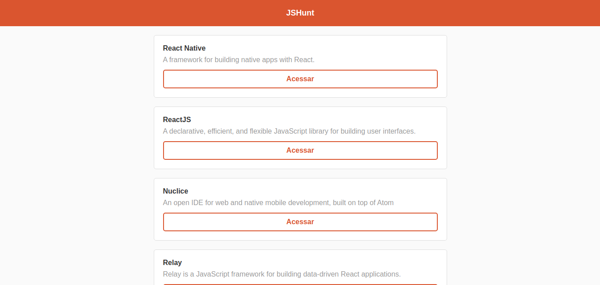
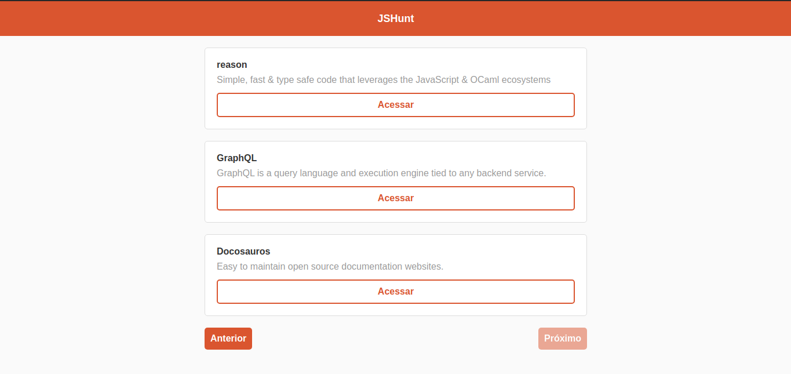
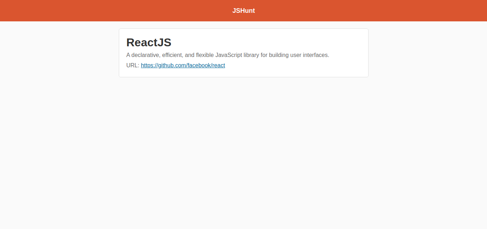

<table align="center"><tr><td align="center" width="9999">

 

[Screens](#Screens) |
[Front-end](https://github.com/EmmanuellaAlbuquerque/starter_rocketseat/tree/master/curso-ReactJS)

#### ReactJS course of Rocketseat Starter.

</td></tr></table>

## Screens
 

JSHunt front-end created for the nodejs api of the previous course module.

